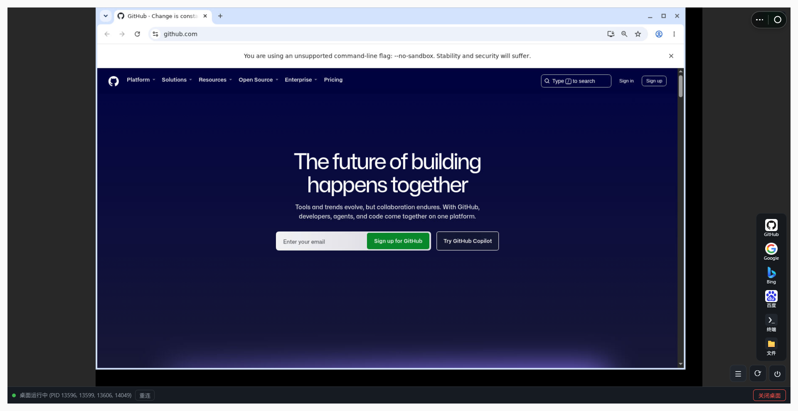

# qwenpaw-desktop — Web 远程桌面插件 v0.0.1

> **专用于 qwenpaw.platform.agentscope.io 平台**。应用启动入口：**应用 → 远程桌面** 🖥️



在 QwenPaw 界面内实时查看**服务器上的虚拟桌面**，鼠标/键盘操作完整映射到远程
桌面（noVNC 客户端 + Xvfb 虚拟屏幕 + openbox 窗口管理器 + x11vnc）。

## 功能

- 纯桌面视图（无浏览器工具栏），右下角竖排快捷入口：GitHub / Google / Bing / 百度 / 终端 / 文件
- 底部最小状态条：连接状态、重连、关闭桌面
- 桌面端物理键盘直接可用；远程 X 桌面强制开启 NumLock，数字小键盘正常
- 适合访问本地打不开的网站（如 github）：在服务器桌面里以 chromium 窗口打开

## ⚠️ 安装前必读：手动安装系统包

**插件不会自动安装系统包**（平台插件机制只自动装 Python/Node 依赖）。请先登录
服务器，手动安装以下系统依赖，再安装本插件：

```bash
# Xvfb 虚拟屏幕
# openbox 窗口管理器（窗口拖拽/缩放）
# x11vnc VNC 服务（仅监听 127.0.0.1）
# xdotool NumLock 设置
# x11-xserver-utils 提供 xset（NumLock 状态检测）
# novnc 前端（/usr/share/novnc）
# xfce4-terminal 终端快捷入口
# thunar 文件管理器快捷入口
# chromium 浏览器（打开 URL）
apt-get install -y \
  xvfb \
  openbox \
  x11vnc \
  xdotool \
  x11-xserver-utils \
  novnc \
  xfce4-terminal \
  thunar \
  chromium
```

> Debian/Ubuntu 的包名即上述名称（`x11-xserver-utils` 提供 `xset`）。

## 需要安装的依赖

### 1. 系统包（apt，见上）

### 2. 快捷入口图标（插件自带，无需额外安装）

图标已随插件打包在 **`assets/icons/`**（github.png / google.png / bing.png /
baidu.png）。`/api/qwenpaw-desktop/icon` 路由**优先从插件自带目录读取**，
缺失时才 fallback 到 `/root/.icons/`——一般无需手动放置。

如需自定义图标：放入 `assets/icons/`（或 `/root/.icons/`），文件名与快捷入口
对应（github/google/bing/baidu），任意 PNG 即可（建议 64x64）。

### 3. Python 依赖

无额外依赖。后端只使用 `fastapi` / `pydantic`（QwenPaw 自带），前端使用
系统安装的 `novnc` 静态资源。

### 4. 网络

在桌面内打开网站需要**服务器能访问目标站点**（如 github.com）。这是本插件的
设计用途：本地访问不了的站，由服务器浏览器打开。

## 安装插件

1. 在服务器上安装上述系统包与图标
2. 从平台插件市场安装本插件（或手动放入 QwenPaw 插件目录 `plugins/`）
3. 打开 QwenPaw，进入 **应用 → 远程桌面** 🖥️ 即可使用

## 架构与安全

```
Xvfb :99（1440x900）
  ├─ openbox
  └─ x11vnc :99 -rfbport 5900（仅 127.0.0.1）
      └─ 插件 WS 转发 /api/qwenpaw-desktop/vnc ⇄ localhost:5900
          └─ 前端 noVNC（/api/qwenpaw-desktop/novnc/）
```

- x11vnc 只监听 127.0.0.1，唯一入口是插件同源 WS 路由（复用 QwenPaw 登录态），不暴露额外端口
- `/open` 只允许 http/https URL

## 进程生命周期

- 首次连接 / 打开 URL / 启动应用时懒启动 Xvfb + openbox + x11vnc（单例幂等）
- 界面可手动「关闭桌面」释放资源；下次操作自动重启
- 插件主服务退出时 shutdown hook 自动清理子进程
